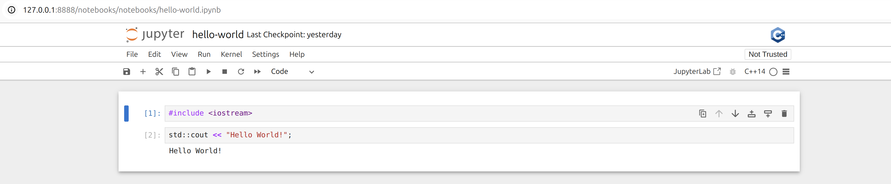

# Harnessing the Power of C++ in Jupyter Notebooks with Xeus Cling



In this README you will find the instructions
to build the images and create a running container.

You also have a notebook example to interact with the
notebook running inside the container and the differents
C++ kernels.

If you want to know more how it works you can read
this interesting [post](https://blog.jupyter.org/interactive-workflows-for-c-with-jupyter-fe9b54227d92).

### Build image

```
docker build -t <image-name> .
```

### Run image

> logs detatached

```
docker run -dp 127.0.0.1:8888:8888 -v $(pwd)/notebooks:/cpp/notebooks --name <container-name> <image-name>
```

> logs presence

```
docker run -p 127.0.0.1:8888:8888 -v $(pwd)/notebooks:/cpp/notebooks --name <container-name> <image-name>
```
